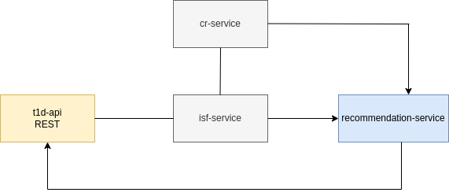

# endoenginnering

A api to provide type-1 diabetes summary calculate. ​👨‍🔬​🔎​🔬​🧪​💉​🏥​💉

## Workflow



# microservices summary

* `t1d-api`: REST Interface.
* `cr-grpc`: gRPC microservice to provide Carbohydrate Ratio
* `isf`: microservice to put the insulin Sensitivity Factor

# API

## Usage

```bash
curl --location --request POST '0.0.0.0:8080/calculator' \
--header 'Content-Type: application/json' \
--data-raw '{
	"cb":45,
	"isf":60,
	"bgl": 12
} ' --silent | jq .
```

```json
{
  "status": 200,
  "insulin_dose": 1.8,
  "insulin_dose_bgl": 72,
  "carbo_needed": 0.007999999
}
```